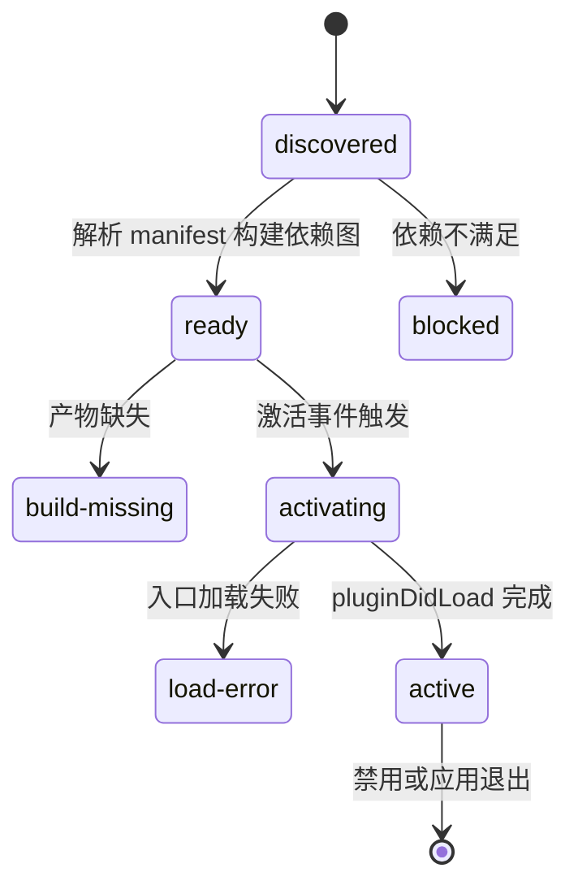

# ABSTRACTIONS

## 术语表

| 术语 | 含义 |
| --- | --- |
| 宿主 | translime 桌面应用（`packages/app`），负责插件发现、激活、UI 加载与系统能力 |
| 插件 | 以 `translime-plugin-` 开头的 npm 包，是宿主运行的最小功能单元 |
| SDK | `translime-sdk`，插件开发的运行时 API 与构建集成 |
| manifest | 插件 `package.json` 中的 `plugin` 字段，声明元数据、激活时机、依赖与命令 |
| 激活 | 宿主加载插件主进程入口并执行 `pluginDidLoad` 的过程 |
| 命令 | manifest `contributes.commands` 声明的静态命令，宿主可在插件未激活时反向激活 |
| preview 模式 | SDK 提供的浏览器调试模式，mock 宿主 API，仅用于 UI 辅助调试 |
| 深链 | `translime://` 协议，用于从外部启动宿主并携带参数 |

## 插件 manifest（package.json.plugin）

| 字段 | 说明 |
| --- | --- |
| `title` / `description` | 展示名称与描述 |
| `icon` | 图标路径（可选），相对插件根目录 |
| `ui` | UI 入口（如 `dist/ui.esm.js`），宿主以 webview 内嵌加载 |
| `windowUrl` | 独立窗口模式 HTML 入口（可选）；`windowUrl.dev` 覆盖开发模式地址 |
| `activationEvents` | 激活时机数组，缺省等价于 `["onStartup"]` |
| `dependencies` | 硬依赖插件列表，启用前必须满足 |
| `optionalDependencies` | 可选依赖插件列表，仅用于能力发现 |
| `contributes.commands` | 静态命令声明：`{ id, title }` |

主进程入口由包级 `main` 字段指向（如 `dist/index.cjs.js`）。插件 ID 即包名，必须全局唯一，且符合 `translime-plugin-[a-z0-9-]+`。

## 插件状态机

| 状态 | 含义 |
| --- | --- |
| `discovered` | 已被扫描发现，元数据可用 |
| `ready` | 依赖满足、构建产物存在，可被激活 |
| `activating` | 正在执行激活流程 |
| `active` | 已加载主进程入口并注册运行期能力 |
| `blocked` | 依赖未满足，被阻塞 |
| `build-missing` | 缺少构建产物 |
| `load-error` | 加载入口失败 |

## 激活事件

| 事件 | 触发时机 |
| --- | --- |
| `onStartup` | 宿主启动时激活（旧插件缺省行为） |
| `onAppReady` | 主窗口稳定后异步激活，适合后台逻辑 |
| `onView` | 打开插件页面或插件窗口前激活 |
| `onCommand:<commandId>` | 执行对应静态命令前激活 |
| `onIpc:<ipcType>` | 第一次收到对应 IPC 调用前激活 |

建议：带 UI 的工具型插件优先使用 `onView`；需要驻留后台的插件才使用 `onStartup` / `onAppReady`；不要把昂贵初始化默认放在 `onStartup`。

## 命名与序列化约定

- 包名：`translime-plugin-*`（小写字母、数字、连字符）。
- IPC 事件：`事件名@插件ID`，例如 `ipc.invoke('get-data@translime-plugin-example')`。
- 构建产物：主进程入口 `index.cjs.js`（CJS），UI 入口 `ui.esm.js`（ESM）。
- 图标：Material Design Icons（md）风格，禁止 `mdi-` 前缀。
- 配置键：`plugin.<插件ID>.settings.<key>`。

## 插件导出与生命周期

插件主进程入口通过命名导出提供以下成员，并在 default export 中汇总：

| 导出 | 说明 |
| --- | --- |
| `pluginDidLoad` | 激活时执行，适合初始化 |
| `pluginWillUnload` | 禁用或退出前执行，适合清理 |
| `pluginSettingSaved` | 设置保存后触发 |
| `settingMenu` | 设置面板声明式配置项 |
| `pluginMenu` | 附加菜单项（Electron MenuItem） |
| `ipcHandlers` | IPC handler 数组，handler 接收 `{ sendToClient }` |
| `commands` | 运行期命令处理函数 |

## SDK 环境边界

| API | 环境 |
| --- | --- |
| `getMainStore()`、`usePluginConfig()`、`usePluginInterop()` | 主进程 |
| `useIpc()`、`useVuetify*()`、`useDialog()`、`useShell()`、`useClipboard()`、`useWindowControl()`、`openLink()`、`getPluginSetting()`、`setPluginSetting()`、`executePluginCommand()`、`electronNetAdapter()` | 渲染进程 |
| `useLogger()`、`isPreviewMode()` | 通用 |

跨环境调用（如在渲染进程访问主进程 Store）是禁止的。插件间通信通过 `usePluginInterop()` 的 `getExports()` / `waitForPlugin()` 完成，依赖关系应优先在 manifest 中声明。

## 不变量

- 插件 ID 全局唯一且等于包名。
- 激活时机必须声明，不把重初始化堆到启动阶段。
- 插件 UI 与宿主 DOM/CSS 隔离；宿主 UI 基于 Vuetify 4，插件 UI 也要求基于 Vuetify 4。
- `main-renderer-ready` 只允许主窗口首屏完成后触发，插件渲染页不得重复触发。
- 真实宿主是主要验证环境，preview 模式不替代宿主内验证。
