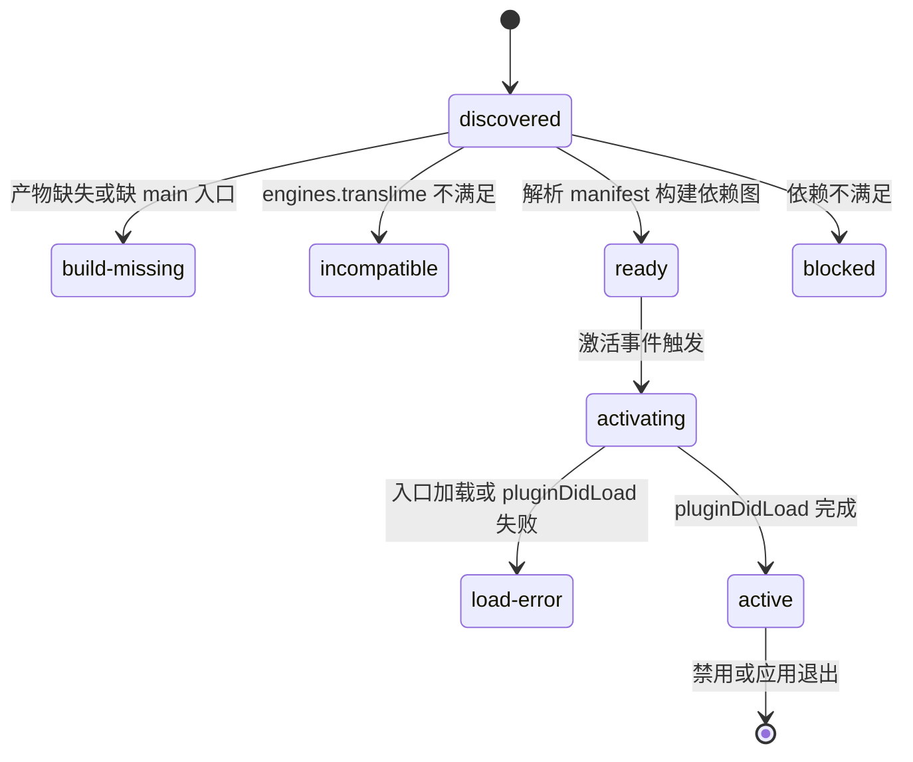

# ABSTRACTIONS

## 术语表

| 术语 | 含义 |
| --- | --- |
| 宿主 | translime 桌面应用（`packages/app`），负责插件发现、激活、UI 加载与系统能力 |
| 插件 | 以 `translime-plugin-` 开头的 npm 包，是宿主运行的最小功能单元 |
| SDK | `translime-sdk`，插件开发的运行时 API 与构建集成 |
| manifest | 插件 `package.json` 中的 `plugin` 字段，声明元数据、激活时机、依赖与命令 |
| 激活 | 宿主加载插件主进程入口并执行 `pluginDidLoad` 的过程 |
| 命令 | manifest `contributes.commands` 声明的静态命令，宿主可在插件未激活时反向激活 |
| preview 模式 | SDK 提供的浏览器调试模式，mock 宿主 API，仅用于 UI 辅助调试 |
| 深链 | `translime://` 协议，用于从外部启动宿主并携带参数 |

## 插件 manifest（package.json.plugin）

| 字段 | 说明 |
| --- | --- |
| `title` / `description` | 展示名称与描述 |
| `icon` | 图标路径（可选），相对插件根目录 |
| `ui` | UI 入口（如 `dist/ui.esm.js`），宿主以 webview 内嵌加载 |
| `windowUrl` | 独立窗口模式 HTML 入口（可选）；`windowUrl.dev` 覆盖开发模式地址 |
| `activationEvents` | 激活时机数组，缺省等价于 `["onStartup"]` |
| `dependencies` | 硬依赖插件列表，启用前必须满足 |
| `optionalDependencies` | 可选依赖插件列表，仅用于能力发现 |
| `isolated` | 隔离运行开关（可选）：`true` 时主进程代码运行在独立 utilityProcess 中，详见下方“隔离运行模式” |
| `contributes.commands` | 静态命令声明：`{ id, title }` |

宿主版本兼容在 package.json 顶层 `engines.translime` 声明（semver 范围，如 `">=0.6.0"`）。
**缺省视为兼容**——旧插件无需声明即可继续运行；声明后由宿主在加载时校验，不满足时插件进入
`incompatible` 状态并保持停用。解析阶段收集的 `manifestWarnings`（无法识别的激活事件、缺少 id
的命令、非法 engines 范围等）会随插件对象返回，由插件卡片展示。

主进程入口由包级 `main` 字段指向（如 `dist/index.cjs.js`）；未声明时插件作为纯 UI 插件运行
（激活后不注册主进程能力），并记录 manifest 警告。入口已声明但产物缺失才视为 `build-missing`。
插件 ID 即包名，必须全局唯一，且符合 `translime-plugin-[a-z0-9-]+`。

manifest 的编辑期校验与字段补全通过 JSON schema 提供：`packages/sdk/translime-plugin.schema.json`
（随 SDK 发布并部署到 github-page），插件 package.json 以 `$schema` 引用；schema 与宿主解析
保持同一份字段契约。

## 插件状态机

| 状态 | 含义 |
| --- | --- |
| `discovered` | 已被扫描发现，元数据可用 |
| `ready` | 依赖满足、构建产物存在，可被激活 |
| `activating` | 正在执行激活流程 |
| `active` | 已加载主进程入口并注册运行期能力 |
| `blocked` | 依赖未满足，被阻塞 |
| `build-missing` | 缺少构建产物或清单未声明主进程入口 |
| `incompatible` | `engines.translime` 范围不满足当前宿主版本，强制停用 |
| `load-error` | 加载入口失败或 `pluginDidLoad` 执行失败（可重试） |

```mermaid
stateDiagram-v2
  state "build-missing" as build_missing
  state "load-error" as load_error
  state "incompatible" as incompatible
  [*] --> discovered
  discovered --> ready: 解析 manifest 构建依赖图
  discovered --> blocked: 依赖不满足
  discovered --> incompatible: engines.translime 不满足
  discovered --> build_missing: 产物缺失或缺 main 入口
  ready --> activating: 激活事件触发
  activating --> active: pluginDidLoad 完成
  activating --> load_error: 入口加载或 pluginDidLoad 失败
  active --> [*]: 禁用或应用退出
```

## 激活事件

| 事件 | 触发时机 |
| --- | --- |
| `onStartup` | 宿主启动时激活（旧插件缺省行为） |
| `onAppReady` | 主窗口稳定后异步激活，适合后台逻辑 |
| `onView` | 打开插件页面或插件窗口前激活 |
| `onCommand:<commandId>` | 执行对应静态命令前激活 |
| `onIpc:<ipcType>` | 第一次收到对应 IPC 调用前激活 |

建议：带 UI 的工具型插件优先使用 `onView`；需要驻留后台的插件才使用 `onStartup` / `onAppReady`；不要把昂贵初始化默认放在 `onStartup`。

## 命名与序列化约定

- 包名：`translime-plugin-*`（小写字母、数字、连字符）。
- IPC 事件：`事件名@插件ID`，例如 `ipc.invoke('get-data@translime-plugin-example')`；渲染端 `useIpc(pluginId)` 与主进程 `defineIpcHandlers` 的 `type` 均可省略后缀，由 SDK / 宿主自动补全。
- 构建产物：主进程入口 `index.cjs.js`（CJS），UI 入口 `ui.esm.js`（ESM）。
- 图标：Material Design Icons（md）风格，禁止 `mdi-` 前缀。
- 配置键：`plugin.<插件ID>.settings.<key>`。

## 插件导出与生命周期

插件主进程入口通过命名导出提供以下成员，并在 default export 中汇总：

| 导出 | 说明 |
| --- | --- |
| `pluginDidLoad` | 激活时执行，适合初始化 |
| `pluginWillUnload` | 禁用或退出前执行，适合清理 |
| `pluginSettingSaved` | 设置保存后触发 |
| `settingMenu` | 设置面板声明式配置项 |
| `pluginMenu` | 附加菜单项，由宿主渲染端 M3 菜单渲染，支持 Electron MenuItem 子集（`id`/`label`/`click`/`type`/`checked`/`enabled`/`visible`） |
| `ipcHandlers` | IPC handler 数组，handler 接收 `{ sendToClient }` |
| `commands` | 运行期命令处理函数 |

`settingMenu` 属于声明式元数据：宿主在构建插件上下文菜单时按需加载入口模块并合并
（`ensurePluginMetadata`，只读静态导出，不注册 IPC / 命令 / libs，也不执行
`pluginDidLoad`），因此未激活、未启用的插件同样能随时打开配置面板；配置读写走
config store，保存时的 `pluginSettingSaved` 仅在插件处于激活态时回调。入口模块经
require 缓存与激活共享，预读不会重复执行顶层代码；停用/卸载会随缓存清理一并失效
静态元数据。`pluginMenu` 的点击语义伴随激活，仍在激活时合并。

## SDK 环境边界

| API | 环境 |
| --- | --- |
| `getMainStore()`、`usePluginConfig()`、`usePluginInterop()`、`defineIpcHandlers()` | 主进程（前三个在隔离模式下抛错） |
| `useIpc()`、`useVuetify*()`、`useMat()` / `useMde()`、`useMatComponents()`、`useMatDirectives()`、`useDialog()`、`useShell()`、`useClipboard()`、`useWindowControl()`、`openLink()`、`getPluginSetting()`、`setPluginSetting()`、`executePluginCommand()`、`electronNetAdapter()` | 渲染进程 |
| `useLogger()`、`isPreviewMode()`、`isIsolatedMode()` | 通用 |

跨环境调用（如在渲染进程访问主进程 Store）是禁止的。插件间通信通过 `usePluginInterop()` 的
`getExports()` / `waitForPlugin()` 完成，依赖关系应优先在 manifest 中声明。

## IPC 通道与安全边界

- 插件 handler 统一注册为 `事件名@插件ID`；宿主内置通道不带后缀。通道登记带所有者信息，
  插件不能抢占宿主内置通道，也不能注册/注销其他插件已登记的通道；相同所有者重复注册（插件重启）
  允许原地替换。
- 已归属插件的渲染端（插件 webview / 独立插件窗口）只能调用自身通道；**跨插件 IPC 仅对暴露了
  `libs`（pluginInterop 已注册）的插件放行**，否则调用被拒绝并提示改用 interop。宿主窗口等未归属
  发送方不受限制。
- `getPluginSetting` / `setPluginSetting` 仅允许读写自身插件的 `plugin.<id>.settings`；
  `appConfigStore` 对插件归属发送方只读，禁止 `delete` / `clear` 与 `plugin.*` 键写入。
- `openLink` 仅放行 http/https；`load-plugin-ui` 仅允许读取插件目录内的 UI 产物；
  渲染端日志级别按 winston 白名单收敛。

## 隔离运行模式

manifest 声明 `plugin.isolated: true` 时，插件主进程代码运行在独立 utilityProcess
（`src/main/isolated-child` 引导，`isolatedRuntime.js` 桥接）：

- 支持完整的 `pluginDidLoad` / `pluginWillUnload` / `pluginSettingSaved`、`ipcHandlers` 与
  `commands`，子进程崩溃会转为 `load-error`（含退出码），不再影响宿主与其他插件。
- 不支持 `libs` 导出与 `getMainStore` / `usePluginConfig` / `usePluginInterop`（SDK 抛出明确错误）；
  `sendToClient` 仅支持主窗口与 `'all'` 两种目标。

## 不变量

- 插件 ID 全局唯一且等于包名。
- 激活时机必须声明，不把重初始化堆到启动阶段；`engines.translime` 缺省兼容，声明即校验。
- 插件 UI 与宿主 DOM/CSS 隔离；宿主 UI 基于 mde-vue。插件 UI 可基于 Vuetify 4（兼容存量，宿主提供 `window.vuetify$` 运行时与 `--v-theme-*` 主题变量），也可基于 mde-vue（宿主提供 `window.mde$` 运行时，需 `engines.translime >= 0.7.0`）；两组运行时均由宿主提供，插件不打包组件库。
- 宿主页面带 CSP 基线（禁远程脚本，`script-src 'self' 'unsafe-eval' blob:`），后续目标是移除 `unsafe-eval`。
- `main-renderer-ready` 只允许主窗口首屏完成后触发，插件渲染页不得重复触发。
- 真实宿主是主要验证环境，preview 模式不替代宿主内验证。
