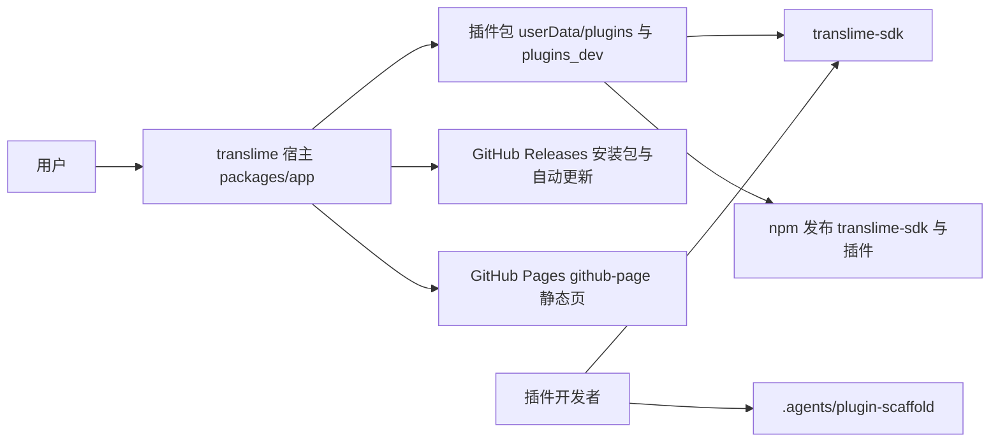
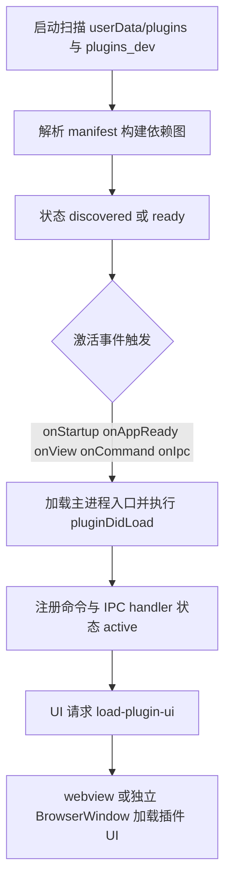

# ARCHITECTURE

## 当前状态摘要

仓库是 pnpm workspace 单仓：`packages/app`（宿主应用，0.6.x）、`packages/sdk`（插件 SDK，1.0.x）与若干 `translime-plugin-*` 插件包。宿主基于 Electron，插件系统采用"描述符扫描 + 按触发激活"模型：启动时只解析 manifest 并构建依赖图，插件在其声明的激活事件（`onStartup`、`onView`、`onCommand`、`onIpc` 等）触发时才执行入口代码。插件 UI 默认运行在隔离的 `<webview>` 或独立 BrowserWindow 中；内嵌渲染路径由宿主 app 使用 `@scope` 与 CSS layer 限制插件样式的选择器作用域。

插件主进程代码默认与宿主同进程运行，可通过 `plugin.isolated: true` 声明进入隔离模式（utilityProcess）；manifest 可用 `engines.translime` 声明宿主版本兼容范围（缺省视为兼容）。IPC 通道带归属登记：插件不能抢占他人通道，跨插件调用仅对暴露 `libs` 的插件放行。

## 架构原则

- 声明式激活：插件通过 `package.json.plugin.activationEvents` 声明激活时机，宿主按事件路由激活。
- 环境隔离：主进程与渲染进程 API 严格分开（见 [ABSTRACTIONS.md](ABSTRACTIONS.md) 的环境边界表）。
- 样式与 DOM 隔离：插件 UI 默认运行在 OOP webview 或独立窗口内。
- 宿主优先：真实宿主是插件的主要验证环境。

## 技术栈

| 技术 | 用途 |
| --- | --- |
| Electron ~39 | 宿主运行时 |
| Vue 3 + mde-vue | 宿主 UI（Material 3 Expressive 组件与主题） |
| Vue 3 + Vuetify 4 | 插件 UI 运行时（由宿主提供 `window.vuetify$`） |
| Tailwind CSS v4 | 宿主与部分插件的样式 |
| Vite 8 | 宿主、SDK 与插件的构建 |
| Pinia | 宿主渲染进程状态 |
| electron-store | 配置持久化 |
| winston | 日志 |
| vitest | 单元测试 |
| electron-updater | 自动更新 |
| mde-vue（GitHub 仓库锁定提交） | 宿主渲染进程的 M3 2025 动态主题与 `--mat-sys-color-*` 令牌来源 |
| @material/material-color-utilities 0.4.0 | 宿主为插件桥接 Vuetify 主题色时的 M3 2025 配色生成 |
| pnpm workspace | 多包管理 |

宿主源码为 ESM（`"type": "module"`），构建时主进程产物为 CJS（`dist/main/index.cjs`），渲染进程产物为 ESM。

## 系统上下文


```mermaid
flowchart LR
  User[用户] --> App[translime 宿主 packages/app]
  App --> Plugins[插件包 userData/plugins 与 plugins_dev]
  App --> GitHub[GitHub Releases 安装包与自动更新]
  App --> Pages[GitHub Pages github-page 静态页]
  Dev[插件开发者] --> SDK[translime-sdk]
  Dev --> Scaffold[.agents/plugin-scaffold]
  Plugins --> SDK
  Plugins --> Npm[npm 发布 translime-sdk 与插件]
```

## 主要模块与所有权边界

### 宿主主进程（packages/app/src/main）

- `index.js` / `launch.js` / `createElectronApp.js`：应用入口与启动编排。
- `utils/linuxDesktopIntegration.js`：Linux 桌面环境（Wayland / X11）XDG 图标与 .desktop 启动项自动注册。
- `core/pluginLoader.js`：插件系统门面，维护插件列表、命令注册表与激活索引，把具体实现委托给 `plugin-loader/` 子模块：
  - `plugin-loader/constants.js`：路径、状态与激活常量
  - `plugin-loader/discovery.js`：目录扫描、manifest 解析、依赖图与激活索引
  - `plugin-loader/metadata.js`：manifest 安全读取、`engines.translime` 兼容校验、manifest 警告收集与状态刷新
  - `plugin-loader/runtime.js`：激活、启停、命令执行与 IPC 就绪；生命周期回调（`pluginDidLoad`/`pluginWillUnload`/`pluginSettingSaved`）异常隔离，激活全程记录耗时；静态元数据（`settingMenu`）支持激活前按需延迟加载，未激活/未启用插件也能打开配置面板
  - `plugin-loader/isolatedRuntime.js`：隔离模式宿主侧，fork utilityProcess 并桥接 IPC/命令/日志，子进程崩溃转为 `load-error`
  - `plugin-loader/pluginSenderRegistry.js`：插件渲染端（webview / 独立窗口）归属登记，供 IPC 收口校验
  - `plugin-loader/installer.js` 与 `plugin-loader/packageInstaller.js`：插件安装与卸载
  - `plugin-loader/devPluginWizard.js`：宿主内「创建/引入开发插件」向导的纯文件操作（模板复制、占位符替换、junction 链接），模板随宿主打包（electron-builder `extraResources`，开发模式直接读 monorepo 模板包）
  - `plugin-loader/devPluginWatcher.js`：监听已启用开发插件的 `dist` 目录，构建产物变化后防抖自动重启该插件，仅作用于 `showDevPlugin` 开启时的 dev 插件
  - `plugin-loader/menu.js`：插件菜单描述生成，把菜单项与点击处理函数登记到 `core/menuRegistry.js`，由渲染端 M3 菜单（`HostMenu`）展示并把点击动作回传执行
  - `core/menuRegistry.js`：渲染端菜单的动作登记与分发（`menuId` + 菜单项 id 一次性消费）
  - `core/textEditMenu.js`：文本编辑上下文菜单（撤销/重做/剪贴板）描述生成，动作作用于原 `WebContents`
  - `core/ipcContext.js`：跨 `Ipc` 与 handler 侧共享的 `AsyncLocalStorage` 请求上下文
  - `plugin-loader/nativeLoader.js`：原生模块加载补丁
  - `main/isolated-child/`：隔离模式子进程引导脚本（`vite.isolated-child.config.js` 构建为 `dist/isolated-child/index.cjs`，零 Electron 依赖）
- `core/ipcHandler.js`：注册宿主与插件的 IPC handler，提供插件激活入口。
- `core/Ipc.js`：IPC 基础封装。
- `core/pluginInterop.js`：已激活插件之间的 API 共享。
- `core/autoUpdate.js`：基于 electron-updater 的自动更新。
- `core/deepLink.js`：`translime://` 深链注册与分发。
- `core/netHandler.js`：暴露给 `window.ts.net` 的网络请求层。
- `core/tray.js`：系统托盘。
- `utils/`：配置存储、窗口、日志、manifest 读取、应用管理等。

### 渲染进程（packages/app/src/renderer）

- 宿主 UI 基于 mde-vue（`plugins/matUi.js` 安装 `createMatUi`）：主题由 `useMatTheme` 主题控制器驱动，向 `document.documentElement` 写入 53 个 `--mat-sys-color-*` 令牌与 `data-mat-theme` 属性；明暗模式、种子色与配色变体（Expressive/TonalSpot/Vibrant/Neutral，M3 2025 规范）由 `hooks/useTheme.js` 双向同步。
- 插件兼容层（`plugins/vuetify.js` + `plugins/vuetifyCompat.js`）：Vuetify 4 仍随宿主初始化，并向所有加载宿主页面的文档（主窗口、插件窗口、内嵌 webview）提供 `window.vuetify$`（components/labs/directives）；`hooks/useTheme.js` 通过 `mdColorHelper`（@material/material-color-utilities）把配色写入 Vuetify theme，保证插件 UI 与宿主配色一致。
- `plugins/matUi.js` 同时向插件提供 mde-vue 运行时 `window.mde$`（components/directives/functions/theme，functions 为 `snackbar()`/`dialog()`/`confirm()` 等命令式函数，与 `window.vuetify$` 对称），SDK 会把插件源码中的 `mat-*` / `mde-*` 组件引用注入为对该对象的解构；宿主与 SDK preview 均通过 `createMatUi` 全局注册 `mat-*` 组件与 `v-intersection`、`v-state-layer` 指令。
- `views/plugins/`：插件列表、插件页与设置面板；`PluginRender.vue` 负责在 app renderer 中加载内嵌插件 UI，`EmbeddedPluginWebviews.vue` 负责在 `<webview>` 中加载插件 UI。
- `utils/pluginStyleIsolation.js`：监听动态 `style`/`link` 节点，为内嵌插件样式保留插件 layer 并包裹 `@scope (.plugin-ui-loader[data-plugin-id="插件ID"])`；对 `:root`、`:host`、`html`、`body` 根级规则提供 `:scope` 兼容转换。
- `components/JsonTree.vue`：日志详情的懒加载 JSON 树（替代 Vuetify labs 的 v-treeview）。
- `PluginWindow.vue` 与 `views/Layout/PluginWindow.vue`：独立 BrowserWindow 形态的插件窗口。
- `store/`、`hooks/`、`components/`：宿主自身的状态与 UI 组件。

### 共享与预加载

- `share/`：主/渲染共享常量与工具，IPC 事件名集中在 `share/utils/ipcConstant.js`。
- `preload/index.js`：桥接渲染进程与主进程。

### SDK（packages/sdk）

- `src/index.js` 与 `src/index.d.ts`：运行时 API 与类型（主进程、渲染进程、通用三组）；`useIpc(pluginId)` 为事件名自动补全 `@插件ID` 后缀，`defineIpcHandlers()` 在激活前校验 `ipcHandlers` 导出结构。
- `src/vite-plugin.js`：`translimeSdk()` Vite 插件与 `createPluginCssIsolationPlugins()` CSS 提取、注入和去重封装；插件选择器作用域由宿主 app 运行时完成。preview 模式支持 `previewIpcMocks` 声明式 IPC mock。
- `src/preview/` 与 `src/preview-mock.js`：浏览器 preview 模式 shell 与 mock 实现。
- `src/electronNetAdapter.js`：基于 `window.ts.net` 的 axios adapter。
- `translime-plugin.schema.json`：插件 manifest（package.json 的 `plugin` 字段与 `engines.translime`）的 JSON schema，随 npm 发布并部署到 github-page，供插件 package.json 的 `$schema` 引用做编辑期校验。
- 发布产物：`dist/index.(js|cjs)`、`dist/vite-plugin.*`、`dist/preview.*`、`dist/preview-mock.*` 与类型声明。

### 插件包（packages/translime-plugin-*）

标准结构：主进程入口构建为 `dist/index.cjs.js`，UI 入口构建为 `dist/ui.esm.js`，元数据声明在 `package.json.plugin`。`packages/template-translime-plugin` 是脚手架模板与开发指南；`translime-plugin-steam-save-backup` 与 `translime-plugin-hdr-capture` 是进阶参考（复杂 UI、原生绑定、覆盖窗口）。

## 关键数据流

1. 插件发现：应用就绪后扫描 `userData/plugins`（发布插件）与 `userData/plugins_dev`（开发插件）下的 `node_modules`，与渲染进程首屏并行执行；读取各包 manifest，构建依赖图与激活索引，插件状态进入 `ready`。`onStartup` 插件的激活在主窗口首屏（含关键字体）就绪后、窗口展示前收尾，启动动画持续到内容就绪；晚于首屏拉取才完成的激活（典型是隔离插件的异步握手）由宿主推送 `plugins-changed` 让渲染端刷新。
2. 插件激活：激活事件触发后，宿主加载插件主进程入口（CJS，配合原生模块加载补丁），执行 `pluginDidLoad`，注册命令与 IPC handler，状态进入 `active`。
3. IPC 调用：插件 UI 通过 `ipc.invoke('事件名@插件ID', ...)` 调用；宿主按插件 ID 路由到对应 `ipcHandlers`，handler 可拿到 `sendToClient` 主动推送；若插件尚未激活且声明了 `onIpc`，宿主先激活再路由。
4. 插件 UI 加载：渲染进程请求 `load-plugin-ui`，`ui` 由 `PluginRender.vue` 在宿主 renderer 文档中动态加载（该路径可位于缓存的 webview 中），`windowUrl` 在独立窗口中加载；webview 实例在路由切换时缓存复用。
5. 设置读写：`getPluginSetting` / `setPluginSetting` 读写配置中 `plugin.<插件ID>.settings.*`。
6. 插件间通信：已激活插件通过 `pluginInterop.getExports()` / `waitForPlugin()` 访问其他插件导出的 API；依赖关系优先在 manifest 中声明。


```mermaid
flowchart TD
  A[启动扫描 userData/plugins 与 plugins_dev] --> B[解析 manifest 构建依赖图]
  B --> C[状态 discovered 或 ready]
  C --> D{激活事件触发}
  D -->|onStartup onAppReady onView onCommand onIpc| E[加载主进程入口并执行 pluginDidLoad]
  E --> F[注册命令与 IPC handler 状态 active]
  F --> G[UI 请求 load-plugin-ui]
  G --> H[webview 或独立 BrowserWindow 加载插件 UI]
```

## 数据存储

- 插件安装目录：`<userData>/plugins`（发布版）与 `<userData>/plugins_dev`（开发版），各自含 `node_modules`。
- 插件包解压目录：`<userData>/plugins/package`。
- 原生模块临时目录：系统 temp 下的 `translime-node-cache`。
- 配置：electron-store 持久化的应用配置，插件设置键为 `plugin.<插件ID>.settings.<key>`。
- 日志：winston 写入用户数据目录，宿主内 LogViewer 可查看。

## 构建、部署与运行

- 宿主构建：`pnpm build:app` 产出 `packages/app/dist`，electron-builder 打包到 `packages/app/dist_electron`（Windows 输出 NSIS 安装包与 portable；Linux 输出 AppImage 与 tar.gz）。
- 自动更新：electron-updater 从 GitHub Releases（slime7/translime）拉取 `latest.yml` 与安装包。
- CI（.github/workflows）：
  - `build.yaml`：打 tag `v*.*.*` 或手动触发，在 windows-latest 与 ubuntu-latest + Node 20 矩阵上安装依赖并构建宿主，产物（Windows exe/yml 与 Linux AppImage/tar.gz）上传为 draft release。
  - `publish-package.yaml`：`dev` 上 SDK 或插件的版本清单变化时，在固定的 Windows 2022 runner 上扫描本地版本；只构建、测试、打包并发布 npm 中尚不存在且高于最新版本的包，也可手动指定包名补发。发布使用 npm Trusted Publishing/OIDC，不依赖长期 npm token。
  - `github-page.yaml`：push 到 `dev` 分支时把 `github-page/` 部署到 GitHub Pages。
- 深链：宿主注册 `translime://` 协议，`translime://open/...` 会转发到主窗口。

## 内嵌插件样式隔离

内嵌 UI 的插件根节点由 `PluginRender.vue` 提供 `.plugin-ui-loader[data-plugin-id="插件ID"]`。app renderer 监听插件动态插入的样式节点，并生成以下结构：

```css
@layer translime-plugin {
  @scope (.plugin-ui-loader[data-plugin-id="插件ID"]) {
    /* 插件原始 CSS */
  }
}
```

SDK 的 `createPluginCssIsolationPlugins(pluginId)` 只负责构建产物中的 CSS 提取、运行时注入、样式 ID 去重和插件专用 layer，不再在构建阶段改写普通选择器。宿主会将插件 CSS 中直接或前置使用的 `:root`、`:host`、`html`、`body` 规则映射到 `:scope`，以兼容主题变量和根级规则。

`@scope` 限制选择器匹配范围；继承属性以及 `@keyframes`、`@font-face`、`@property` 等全局命名空间继续遵循浏览器原生语义。独立 `<webview>` 与 BrowserWindow 的文档隔离保持不变，旧版 SDK 已生成的带 `data-plugin-style-id` 标记样式由 app 保留兼容处理。

## 安全、可靠性与可观测性

- 插件 UI 默认运行在 OOP `<webview>` 或独立 BrowserWindow 中，DOM 与 CSS 与宿主隔离；内嵌 UI 由宿主 `@scope` 与 CSS layer 进一步限制样式选择器的影响范围。
- 宿主页面（主窗口、子窗口）带 CSP 基线：禁远程脚本与对象嵌入，`script-src 'self' 'unsafe-eval' blob:`（`blob:` 供内嵌插件 UI 动态加载，`unsafe-eval` 暂为共享 vue 全量构建保留）。
- IPC 通道带归属登记与所有者保护：插件不能覆盖宿主内置通道或他人通道；已归属插件的渲染端跨插件调用 IPC 仅对暴露 `libs` 的插件放行；`get/setPluginSetting` 限定自身插件，`appConfigStore` 对插件归属发送方只读，`openLink` 仅放行 http/https，`load-plugin-ui` 仅允许插件目录内路径。
- 插件主进程代码可选隔离运行（`plugin.isolated: true`）：fork 进 utilityProcess，`pluginDidLoad` 阻塞有超时，子进程崩溃转为 `load-error` 并保留错误码，不再影响宿主与其他插件。
- 常规模式下生命周期回调（`pluginDidLoad`/`pluginWillUnload`/`pluginSettingSaved`）逐个异常隔离：失败转为 `load-error` 并清理已注册的 IPC/命令/interop，激活标记必定释放，插件可重试；激活耗时记录在 `loadDuration`，超过 3s 输出慢激活告警。
- manifest 解析收集 `manifestWarnings`（未知激活事件、缺 id 命令、非法 engines 范围）并在插件卡片展示；入口未导出任何插件 API 时按 `load-error` 处理。
- 原生模块通过 `nativeLoader` 补丁在临时目录加载，应用关闭时清理。
- 插件加载失败不会阻断宿主启动，插件卡片展示 `build-missing`、`load-error`、`blocked`、`incompatible` 等状态。
- 日志集中到 winston 并提供 LogViewer；渲染端日志级别按白名单收敛；IPC 事件名集中在 `ipcConstant.js`，便于统一维护。

## 相关文档与源码入口

- 核心概念：见 [ABSTRACTIONS.md](ABSTRACTIONS.md)
- 环境与命令：见 [GETTING-STARTED.md](GETTING-STARTED.md)
- 插件系统主入口：`packages/app/src/main/core/pluginLoader.js`
- 插件开发规范：[.agents/rules/plugin-development.md](../.agents/rules/plugin-development.md)
- SDK 文档：[packages/sdk/README.md](../packages/sdk/README.md)
